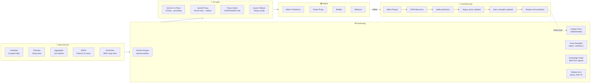

# Oracle Odds AI

> Full-stack sports prediction platform — live odds ingestion, quantitative modelling, and a self-improving learning loop that recalibrates after every settled match.

🌐 **[oracleai.live](https://oracleai.live)** &nbsp;|&nbsp; 📱 **[Telegram](https://t.me/oracleoddsai)** &nbsp;|&nbsp; 🐦 **[@oracleoddsai](https://twitter.com/oracleoddsai)**

---

## Traction

| Metric | Value |
|--------|-------|
| Active users (30 days) | **295** |
| Sessions | **686** |
| Geo spread | Nigeria · USA · Ghana · UK |
| Top cities | Lagos · Chicago · Abuja |
| Stripe checkout sessions | 10 |

*Organic only — zero paid advertising.*

---

## Engine Architecture

---

## What It Does

Oracle ingests live odds from multiple bookmakers, strips the vig to find true fair probabilities, then runs a Poisson-based quantitative model enhanced by Gemini AI narrative. The result: match predictions, player prop analysis, and a bet tracker — across Soccer, NBA, MLB, NFL, and Tennis.

The model gets more accurate over time. Every settled match automatically recalibrates league priors and team strength ratings via Postgres triggers and scheduled edge functions. No manual intervention.

---

## Stack

| Layer | Technology |
|-------|-----------|
| Frontend | React 19 · TypeScript · Tailwind v4 · Vite |
| Backend | Supabase (Postgres · Auth · Edge Functions · Realtime) |
| AI | Gemini 2.5 Flash · multi-key rotation · quant fallback |
| Payments | Stripe (Basic / Premium / Elite tiers) |
| Infra | 6 scheduled cron jobs · Supabase Edge Functions (Deno) |
| Social | Telegram bot · daily automated posts |

---

## Key Engineering

**Self-improving model** — Postgres triggers recalculate team attack/defense ratings on every match settlement. A cron job recalculates league calibration bias from the last 250 settled predictions, weighted by recency. Zero manual tuning.

**Quant-first AI** — The Poisson model always runs first and produces mathematically grounded lambdas. These are injected as hard anchors into the Gemini prompt. When Gemini is down the quant model stands alone. When the math is wrong, the AI corrects it. Neither is the product alone.

**Tier enforcement at 3 layers** — Free users can't access premium data even if they bypass the frontend. Enforced at UI → application logic → Supabase RLS simultaneously.

**Multi-key Gemini rotation** — Server-side key pool with per-key 429 cooldown tracking, fast-fail on consecutive 503s, and automatic fallback chain (2.5 Flash → Flash Lite → 1.5 Flash → quant-only). QuickSlip fires 4 concurrent analyses without hitting rate limits.

**Props Oracle** — Batch OVER/UNDER analysis per match using player rolling form, team strength context, and market odds. Cached 6h in Supabase; fuzzy token-match fallback handles team name variations.

---

## Sports Coverage

Soccer (Premier League · La Liga · Serie A · Bundesliga · Ligue 1 · UCL + more) · NBA · MLB · NFL · Tennis (ATP · WTA)

---

## Subscription Tiers

| | Free | Basic | Premium | Elite |
|-|------|-------|---------|-------|
| Predictions/day | 1 | 3 | 10 | Unlimited |
| QuickSlip | — | 2 slots | Unlimited | Unlimited |
| Props Oracle | — | — | ✓ | ✓ |
| Telegram Alpha | — | — | — | ✓ |

---

Built by [@pushthev1be](https://github.com/pushthev1be)
