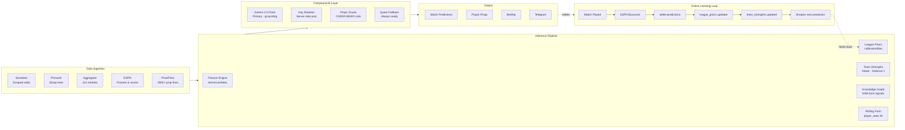

# Oracle Odds AI

> A production compound AI system — quantitative inference engine, self-calibrating ML pipeline, and LLM-augmented prediction deployed to real users at scale.

🌐 **[oracleai.live](https://oracleai.live)** &nbsp;|&nbsp; 📱 **[Telegram](https://t.me/oracleoddsai)** &nbsp;|&nbsp; 🐦 **[@oracleoddsai](https://twitter.com/oracleoddsai)**

---

## Traction

| Metric | Value |
|--------|-------|
| Active users (30 days) | **295** |
| Sessions | **686** |
| Geo spread | Nigeria · USA · Ghana · UK |
| Stripe checkout sessions | 10 |

*Organic only — zero paid advertising.*

---

## What Makes This Different

Most AI sports tools are wrappers: take an LLM, feed it game data, return a pick. Oracle is architecturally different. It runs a generative probabilistic model first, uses those results as hard mathematical anchors, then sends both to an LLM that reasons *on top of* quantitative ground truth — not instead of it. The LLM can correct the math when context matters (injuries, travel, motivation). The math constrains the LLM when it would otherwise hallucinate. Neither is primary. The combination is the system.

Every settled match feeds back into the model automatically. No retraining scripts. No human intervention. The system recalibrates itself using real outcomes.

---

## System Architecture

---

## AI Architecture

### Compound AI System

Oracle implements what AI researchers call a **compound AI system** — multiple models and components working together, each handling what it does best:

- **Poisson model** generates a full P(score) probability matrix. Win/draw/loss probabilities, expected goals, and confidence scores are derived mathematically before any LLM is involved.
- **Gemini 2.5 Flash** receives the quant output as explicit numerical anchors (attack lambda, defense lambda, xG, team strength delta, calibration bias). It cannot override the math — it reasons around it. Grounding is enabled to pull in real-world context the model can't know: injuries reported post-lineup, weather, travel fatigue.
- **Props Oracle** is a second compound layer — it combines rolling player form (last-5/last-10 game averages from ESPN boxscores), team strength context, and live market lines to produce OVER/UNDER calls with confidence scores and a 6-word reasoning trace.
- **Quant fallback** ensures every prediction path is fault-tolerant. If all LLM calls fail, the system returns a complete, mathematically grounded prediction with no degradation visible to the user.

### Online Learning — No Manual Retraining

The model recalibrates itself continuously from real outcomes:

- Every settled match triggers a Postgres function that updates team attack and defense ratings using a 30-game rolling average — similar to an online ELO update, but split across offensive and defensive dimensions independently.
- A scheduled job recalculates league-level `calibrationBias` from the last 250 settled predictions, exponentially weighted toward recent results. This corrects for systematic model drift per sport and competition.
- Player rolling form (`last5avg`, `last10avg`, trend direction) is extracted from ESPN boxscores every 4 hours and injected into prop analyses — replacing static season averages with recency-weighted actuals.
- The knowledge graph stores EMA-smoothed team performance signals (win rate, xG trend, clean sheet rate) that are updated after each match and injected into both the quant model and LLM prompt.

Zero human intervention. The model's accuracy improves as long as matches are played.

### LLM Inference Optimization

Running 4 concurrent LLM analyses per session against a shared API key pool required building a custom inference management layer:

- **Server-side key pool** with round-robin rotation across 5 keys. Keys are stored in Supabase Vault — never exposed in client bundles or logs.
- **Per-key 429 cooldown** (65s) with in-memory tracking. A key that hits a rate limit is skipped automatically; the next available key serves the request.
- **Model fallback chain**: `gemini-2.5-flash` → `gemini-2.5-flash-lite` → `gemini-1.5-flash`. Each step triggers on 429 or 503 from the tier above.
- **Fast-fail on cascading 503s**: after 2 consecutive proxy failures, the client breaks out of the retry loop immediately and triggers quant fallback. Total degradation time: ~5 seconds, not 45.
- **Proxy response cache** (30 min): identical match analyses served from cache without hitting the LLM at all.
- **Client-side output cache** (6h in Supabase, 2h in localStorage): Props Oracle results are keyed by normalized match name + date. A fuzzy token-overlap fallback handles team name variations between data sources.

### Prompt Engineering at Production Scale

The LLM layer is tightly constrained to prevent hallucination and maintain structured output for programmatic parsing:

- Quant outputs (lambdas, xG, form signals, team strength delta) are injected as explicit numerical anchors with hard constraints: "do not deviate from these by more than 15%"
- NBA prompt includes explicit score range enforcement ("95–130 pts per team — soccer-style scores are a CRITICAL ERROR") to prevent cross-domain mode collapse
- Props Oracle uses a strict output schema (`[PROP]player|stat|OVER/UNDER|confidence|reason[/PROP]`) parsed deterministically — any deviation is caught and logged
- Temperature 0.0 for match predictions (deterministic), 0.2 for props (slight variance acceptable)
- Confidence capped at 82 in prompt instructions — Gemini systematically overshoots without this constraint
- Output token budget managed per-call to prevent truncation silently cutting multi-prop batches

---

## Production Engineering

**Tier enforcement at three independent layers** — Free users cannot access premium data even if they bypass the frontend entirely. Enforced at: UI component rendering → application-level gate → Supabase Row Level Security. A user who strips the frontend and calls the DB directly still can't read premium data.

**Settlement engine across heterogeneous data** — Match settlement reads ESPN boxscores across 5 sports. Each sport uses a structurally different API response shape. Soccer stats live in `rosters[].stats[]` as key-value objects. Basketball uses positional index arrays in `boxscore.players[]`. Matches sourced from Football-Data.org use IDs that don't correspond to ESPN event IDs — those require scoreboard fuzzy-matching by player name. Each path is independently implemented with explicit fallbacks.

**6 non-conflicting cron jobs** — `precompute-analyses` (30 min), `settle-predictions` (30 min), `settle-bets` (30 min), `settle-props` (hourly at :30), `precompute-props` (6h), `backfill-history` (4h). Scheduled to avoid simultaneous DB writes to the same tables. The `settle-props` edge function has an explicit 100-second wall-time guard (Supabase edge limit: 150s) to prevent silent truncation of batch settlement runs.

---

## Hard Problems Solved

**Silent model regression costing 16 pts/game** — NBA predictions were systematically wrong. The sport key used at query time (`"nba"`) didn't match the enum stored in the DB (`"Basketball"`). The prior lookup silently returned null, calibration bias was never applied, and every NBA total was off by ~16 points. No error, no warning — just degraded predictions. Surfaced by cross-referencing prediction residuals against league-level distributions. Fixed by normalising sport keys at every prior lookup boundary.

**LLM output format drift silently voiding all results** — Gemini started returning confidence values as natural language ("solid", "lean") instead of integers. `parseInt("solid")` returns `NaN`, the NaN guard silently dropped every parsed result, and the entire props analysis rendered blank with no logged error. Fixed by hardening the prompt schema, adding a word→integer fallback map in the parser, and instrumenting a zero-result warning log so this class of silent failure surfaces immediately.

**ELO key mismatch invalidating all team ratings** — A migration accidentally reverted a prior fix, causing the `team_strengths` trigger to write records keyed by ESPN numeric ID (`"359_Soccer"`) while the inference pipeline read by display name (`"Arsenal_Soccer"`). All DB lookups returned null. Team strength ratings were silently ignored in every prediction for weeks. Fixed by restoring correct key construction in the trigger and backfilling all historical records using the correct naming scheme.

**Concurrent LLM requests exhausting shared key pool** — QuickSlip fires 4 simultaneous analyses. Without coordination, all 4 hit the same key, all get 429, all set the same cooldown, and all retry against the same exhausted key. Fixed with per-key cooldown state shared across concurrent calls and a fast-fail circuit breaker that exits the retry loop after 2 consecutive proxy-level failures rather than thrashing through all permutations.

---

## Stack

| Layer | Technology |
|-------|-----------|
| Frontend | React 19 · TypeScript · Tailwind v4 · Vite |
| Backend | Supabase (Postgres · Auth · Edge Functions · Realtime) |
| AI Inference | Gemini 2.5 Flash · multi-key rotation · quant fallback |
| Quantitative Model | Poisson distribution · ELO-style ratings · calibration bias |
| Payments | Stripe (Basic / Premium / Elite tiers) |
| Infra | 6 scheduled cron jobs · Deno edge functions · pg_cron |
| Social | Telegram bot · daily automated posts |

---

## Sports Coverage

Soccer (Premier League · La Liga · Serie A · Bundesliga · Ligue 1 · UCL + more) · NBA · MLB · NFL · Tennis (ATP · WTA)

---

## Subscription Tiers

| | Free | Basic | Premium | Elite |
|-|------|-------|---------|-------|
| Predictions/day | 1 | 3 | 10 | Unlimited |
| QuickSlip | — | 2 slots | Unlimited | Unlimited |
| Props Oracle | — | — | ✓ | ✓ |
| Telegram Alpha | — | — | — | ✓ |

---

Built by [@pushthev1be](https://github.com/pushthev1be)
