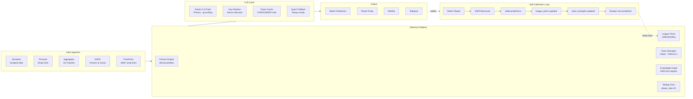

# Oracle Odds AI

> Real-time probabilistic inference engine — quantitative modelling, self-calibrating ML pipeline, and LLM-augmented prediction at production scale.

🌐 **[oracleai.live](https://oracleai.live)** &nbsp;|&nbsp; 📱 **[Telegram](https://t.me/oracleoddsai)** &nbsp;|&nbsp; 🐦 **[@oracleoddsai](https://twitter.com/oracleoddsai)**

---

## Traction

| Metric | Value |
|--------|-------|
| Active users (30 days) | **295** |
| Sessions | **686** |
| Geo spread | Nigeria · USA · Ghana · UK |
| Stripe checkout sessions | 10 |

*Organic only — zero paid advertising.*

---

## System Architecture



---

## What It Does

Oracle is a production ML inference system for sports prediction. It ingests live market data from multiple sources, strips the vig to recover true implied probabilities, and runs a Poisson-based generative model that produces full score-probability matrices. A Gemini 2.5 Flash layer adds contextual reasoning on top of the quant output. Every settled match feeds back into the model automatically — no manual retraining.

---

## Stack

| Layer | Technology |
|-------|-----------|
| Frontend | React 19 · TypeScript · Tailwind v4 · Vite |
| Backend | Supabase (Postgres · Auth · Edge Functions · Realtime) |
| Inference | Gemini 2.5 Flash · multi-key rotation · quant fallback |
| Payments | Stripe (Basic / Premium / Elite tiers) |
| Infra | 6 scheduled cron jobs · Supabase Edge Functions (Deno) |
| Social | Telegram bot · daily automated posts |

---

## ML Engineering

**Self-calibrating model** — No manual tuning. Every settled match triggers a Postgres function that recalculates team attack/defense ratings using a 30-game rolling window. A separate scheduled job recalculates league-level calibration bias from the last 250 settled predictions, weighted by recency via exponential decay. The model's accuracy improves continuously in production with zero human intervention.

**Quantitative inference core** — The Poisson model generates full P(score) matrices from attack/defense lambda pairs derived from team strength ratings and league priors. `calibrationBias` from historical settlement data adjusts both lambdas before scoring. Confidence scores are computed as: `0.50 + winEdge + evBoost(capped 0.15) + dataBoost(0.05)`.

**LLM as a corrective layer, not the product** — Gemini 2.5 Flash receives the quant output as hard anchors (lambdas, xG, form signals, team strengths) and adds narrative reasoning. When the math is wrong, the LLM corrects it. When the LLM is unavailable, the quant model produces a full prediction independently. Neither is the product alone.

**Distributed inference with fault tolerance** — QuickSlip fires 4 concurrent Gemini analyses per session. A server-side key pool with per-key 429 cooldown tracking (65s), round-robin rotation, and a fast-fail after 2 consecutive 503s ensures the quant fallback triggers in ~5s rather than exhausting a full retry chain.

**Multi-source data fusion** — Live odds from Smarkets (scraped), Pinnacle (sharp lines via edge function), and an aggregated feed across 114 markets are merged and de-vigged into true implied probabilities. ESPN provides fixture data and post-match boxscores for settlement across 5 sports (Soccer, NBA, NFL, MLB, Tennis).

---

## Hard Problems Solved

**Silent model regression costing 16 pts/game** — NBA predictions were systematically wrong. The Poisson model loaded calibration data correctly, but the sport key used at query time (`"nba"`) didn't match the enum stored in the DB (`"Basketball"`). The lookup silently returned null, calibration bias was never applied, and every NBA total was off by ~16 points. No error, no warning — just degraded predictions. Fixed by normalising sport keys before every prior lookup; surfaced by cross-referencing prediction residuals against league-level distributions.

**LLM output format drift breaking the inference pipeline** — Gemini started returning confidence values as natural language ("solid", "lean") instead of integers. `parseInt("solid")` returns `NaN`, the NaN guard silently dropped every parsed result, and the entire props analysis rendered blank with no logged error. Fixed by hardening the prompt with explicit format constraints, adding a word→integer fallback map in the parser, and instrumenting a zero-result warning so this class of silent failure is immediately detectable.

**Settlement across three structurally different data shapes** — Soccer stats live in ESPN's `rosters[].roster[].stats[]` as `{abbreviation, value}` objects. Basketball uses `boxscore.players[]` with positional index arrays. Football-Data.org match IDs don't correspond to ESPN event IDs at all — those require scoreboard fuzzy-matching by player name. Each path is independently implemented in the settlement engine with explicit fallback logic.

**ELO key mismatch invalidating all team ratings** — A migration accidentally reverted a prior fix, causing the `team_strengths` trigger to write records keyed by ESPN numeric ID (`"359_Soccer"`) while the inference pipeline read by display name (`"Arsenal_Soccer"`). All DB lookups returned null, team strength ratings were silently ignored in every prediction. Fixed by restoring correct key construction in the trigger function and backfilling from full match history using the correct naming scheme.

---

## Self-Improving Pipeline

```
1. Match plays  →  ESPN boxscore fetched
2. settle-predictions (cron)  →  outcome written to predictions_ledger
3. Postgres trigger  →  team attack/defense lambdas recalculated (30-game window)
4. Scheduled job  →  league calibrationBias recalculated (last 250 rows, recency-weighted)
5. backfill-history (4h)  →  per-player stats extracted into player_stats table
6. getRollingForm()  →  last-5/last-10 averages replace static season averages
7. precompute-analyses (30min)  →  fresh predictions stored with updated priors
```

---

## Sports Coverage

Soccer (Premier League · La Liga · Serie A · Bundesliga · Ligue 1 · UCL + more) · NBA · MLB · NFL · Tennis (ATP · WTA)

---

## Subscription Tiers

| | Free | Basic | Premium | Elite |
|-|------|-------|---------|-------|
| Predictions/day | 1 | 3 | 10 | Unlimited |
| QuickSlip | — | 2 slots | Unlimited | Unlimited |
| Props Oracle | — | — | ✓ | ✓ |
| Telegram Alpha | — | — | — | ✓ |

---

Built by [@pushthev1be](https://github.com/pushthev1be)
