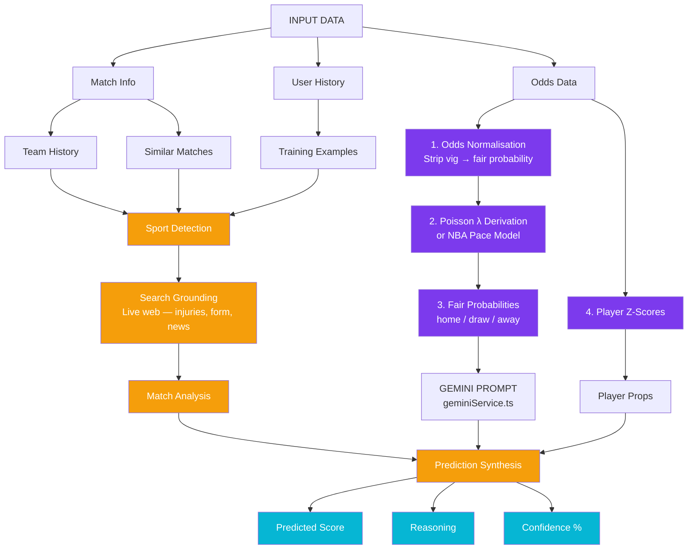
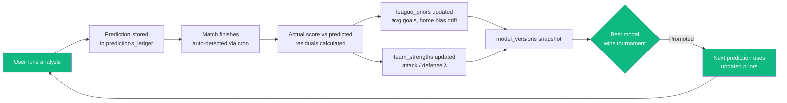
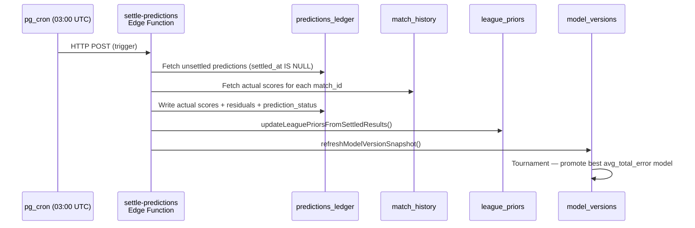
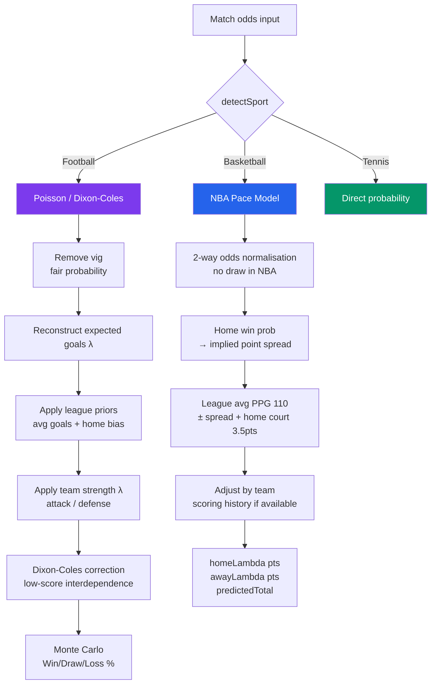
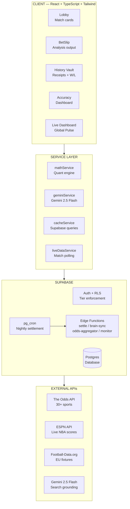

# Oracle Odds AI — System Architecture

## AI Pipeline Flow

---

## Adaptive Learning Loop

---

## Settlement Flow (nightly pg_cron)

---

## Quant Engine — Sport Branching

---

## Infrastructure Overview

